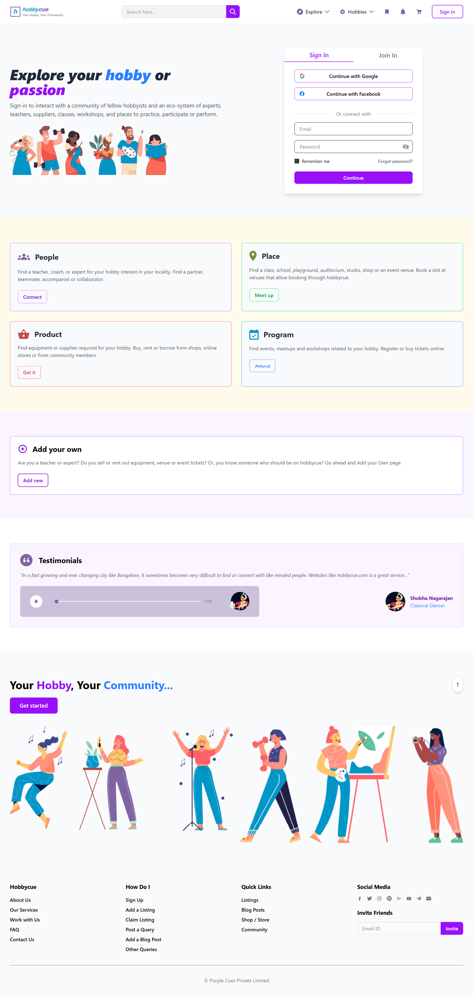

# HobbyCue - Front-End Clone

This project is a front-end implementation of the HobbyCue landing page, built using React.js and Tailwind CSS. The primary goal was to create a pixel-perfect replica of a provided Figma design file.

**Live Demo:** [https://hobbycue-taupe.vercel.app/](https://hobbycue-taupe.vercel.app/)



## Tech Stack
- **React.js:** For building the user interface components.
- **Tailwind CSS:** For utility-first styling and rapid UI development.
- **Vite:** As the build tool for a fast development experience.
- **Vercel:** For deployment and hosting.

## Setup & Installation
1. Clone the repository:
   ```sh
   git clone [https://github.com/RohanBhoge/hobbycue](https://github.com/RohanBhoge/hobbycue)
    ```

2.  Navigate into the directory:

    ```sh
    cd hobbycue-project
    ```
3.  Install dependencies:
    ```sh
    npm install
    ```
4.  Run the development server:
    ```sh
    npm run dev
    ```

<!-- end list -->
